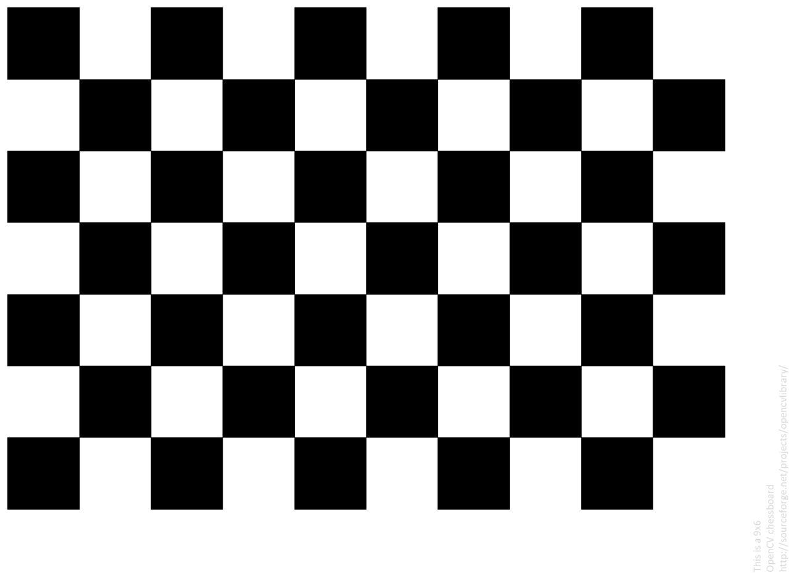

# Camera-Calibration

## Installation
1. Clone or download this repository.

2. Make sure python 3.x is installed on your PC. To check if and which version is installed, run the following command:
```
python -V
```
If this results an error, this means that python isn’t installed on your PC! please install it from [the original website](https://www.python.org/)

3. (optional) it is recommended that you create a python virtual environment and install the necessary libraries in it to prevent versions collisions:

4. Install required libraries from the provided file (**requirements.txt**):
```
pip install -r requirements.txt
```
Make sure you provide the correct path of **requirements.txt**

5. run the scrips, reference usage


## image Specification

相机标定是进行视觉测量和定位的基础工作之一，标定参数准确与否直接关系到整个系统的精度，参考网上相机标定过程中标定图片的获取过程中需要注意的问题总结如下（下面是参考）：

（1）、标定板拍摄的张数要能覆盖整个测量空间及整个测量视场，比如把相机图像分成四个象限（也可以分成很多个格子，下面是参考）（如图1所示），应保证拍摄的标定板图像均匀分布在四个象限中，且在每个象限中建议进行不同方向的两次倾斜，图2是一组推荐摆放方式图片。


（2）、标定图片的数量，通常在20~30张之间（建议采样是获取多十几张），图像数量太少，容易导致标定参数不准确。

（3）圆或者圆环特征的像素数尽量大于20，标定板的成像尺寸应大致占整幅画面的1/4。

（4）用辅助光源对标定板进行打光，保证标定板的亮度足够且均匀.

（5）标定板成像不能过爆，过爆会导致特征轮廓的提取的偏移，从而导致圆心提取不准确。

（6）标定板特征成像不能出现明显的离焦距，出现离焦时可通过调整调整标定板的距离、光圈的大小和像距（对于定焦镜头，通常说的调焦就是指调整像距）。

（7）标定过程，相机的光圈、焦距不能发生改变，改变需要重新标定。


## how to get image

```bash
# 下面是android 的参考过程
# step01 安装vedio拍照
F:\xuanwu\tools\aiot-release-V20210331-202106041540.apk
adb connect id_Address
adb devices # checking the connecting
adb install F:\xuanwu\tools\aiot-release-V20210331-202106041540.apk

# step02 拍照
# step03 pull the images
E:\data\camera_calibration
```

## usage
```bash
# you need change image_dir /image_format/棋盘对应的检测列（col_nums，9）/棋盘对应检测的行（row_nums,6）,如下图/棋盘方块对应的大小（SQUARE_SIZE， 黑色正方形的长或宽, centimeter）。
# step01 get calibration_chessboard.yml
python calibrate_chessboard.py --image_dir "E:\data\camera_calibration\chess_photo" --col_nums 9 --row_nums 6 --square_size 2.5 --image_format '.jpg'

# step02 undist
python undist.py --image_dir "E:\data\camera_calibration\test_on_line2" --parameter_file "calibration_chessboard.yml" # load the camera calibration_chessboard.yml and distort

```


## calibration parameter and add code

```bash
# note SQUARE_SIZE 指的是正方向的大小。
data: [ 6.3679404207355321e+02, 0., 6.3701922316458365e+02, 0.,
       6.4220781758881571e+02, 3.1267232337362935e+02, 0., 0., 1. ]
D: !!opencv-matrix
   rows: 1
   cols: 5
   dt: d
   data: [ -3.6721049616656565e-01, 1.1686644036526267e-01,
       1.3678611194601928e-03, 1.3781249474976913e-03,
       -1.5966288380859801e-02 ]
```

新增代码:缩放原图到90%，在周边padding 到原图大小

```bash
Mat src, dst;
int top, bottom, left, right;
int borderType = BORDER_CONSTANT;
cv::Mat roi_dest;
cv::resize(roi, roi_dest, cv::Size(), 0.9 , 0.9 );

top = (int) (0.05*roi.rows); bottom = top;
left = (int) (0.05*roi.cols); right = left;

Scalar value(255,255,255);
copyMakeBorder( roi_dest, dst, top, bottom, left, right, borderType, value );
```


## reference
- [code referece](E:\gitlab\cpp\test\camera_calibrateion.cpp) and [opencv offical camera calibration python](https://opencv24-python-tutorials.readthedocs.io/en/latest/py_tutorials/py_calib3d/py_calibration/py_calibration.html）
- [world coor and camera coor](https://www.cnblogs.com/mikewolf2002/p/5746667.html)
- [张正友相机标定Opencv实现以及标定流程&&标定结果评价&&图像矫正流程解析](https://blog.csdn.net/dcrmg/article/details/52939318)
- [https://medium.com/vacatronics/3-ways-to-calibrate-your-camera-using-opencv-and-python-395528a51615](https://medium.com/vacatronics/3-ways-to-calibrate-your-camera-using-opencv-and-python-395528a51615)
- [undistor](https://aishack.in/tutorials/calibrating-undistorting-opencv-oh-yeah/) and [c++ code](https://github.com/Thomio-Watanabe/undistort_images/blob/master/src/main.cpp)
- [opencv offical camera calibration cpp](https://github.com/opencv/opencv/blob/master/samples/cpp/tutorial_code/calib3d/camera_calibration/camera_calibration.cpp))
- [image specification]((https://blog.csdn.net/j_shui/article/details/77262947))
## key word
摄像头标定 camera calibration


#   

